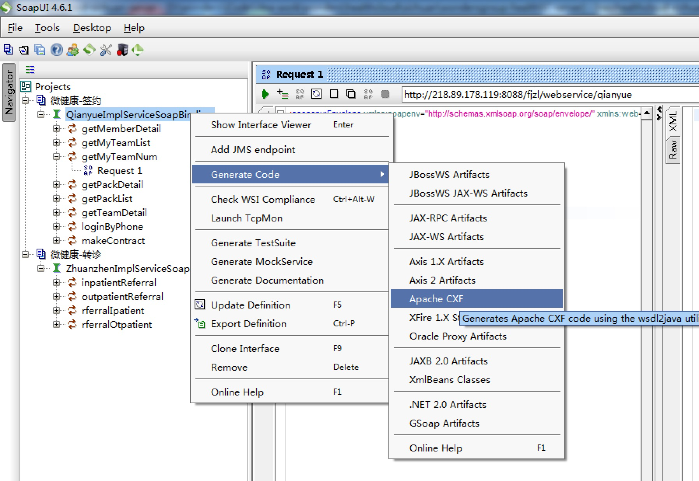
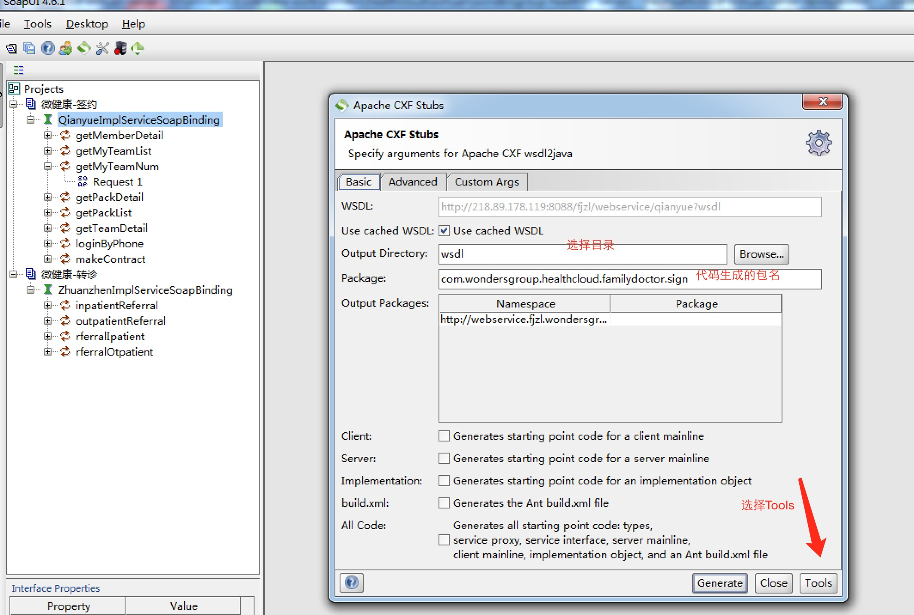
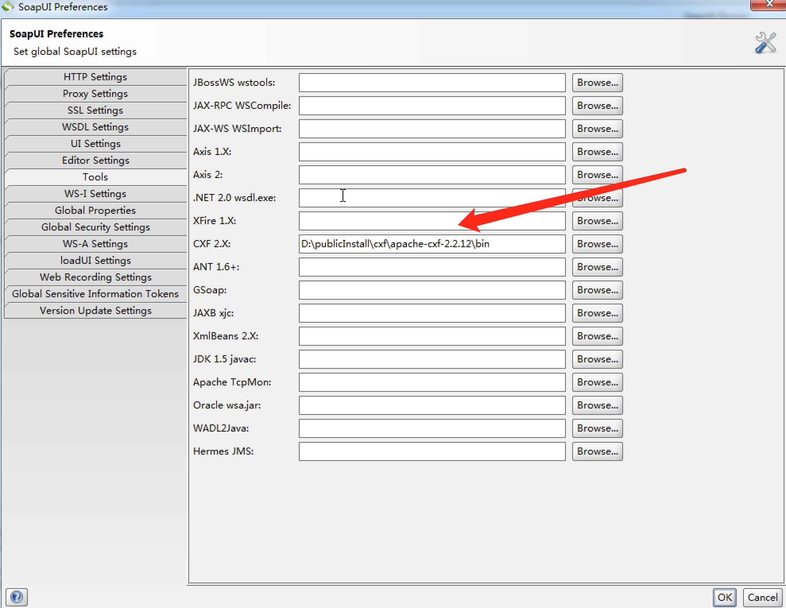
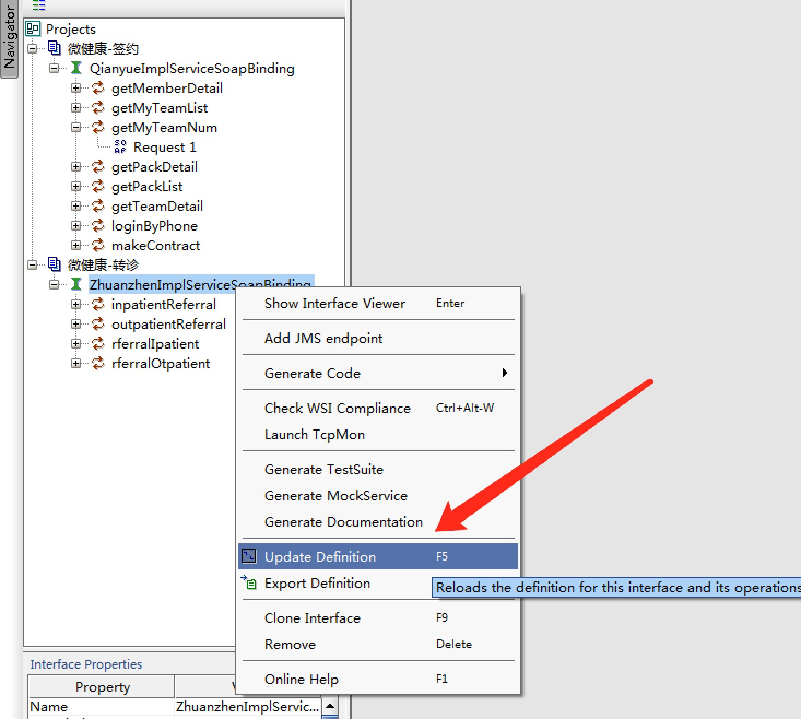

# WSDL2JAVA

## 1. new soap project
使用soapui工具，分别对两个WSDL URL创建soap project

## 2. generate code
选择Apache Cxf方式，如图1：

选择代码生成的目录、包名，如图2：

配置CXF bin路径，如图3：

## 3. 拷贝生成的代码到工程
签约接口的代码，拷贝至：com.wondersgroup.healthcloud.familydoctor.services.sign
转诊接口的代码，拷贝至：com.wondersgroup.healthcloud.familydoctor.services.referral

## 4. 更新WSDL接口
如果对方接口发生变更（增加 or 删除 or 修改），需要更新工程，然后重新生成代码；
*更新soap project工程，如下图：

*重新生成代码(同上,略...)